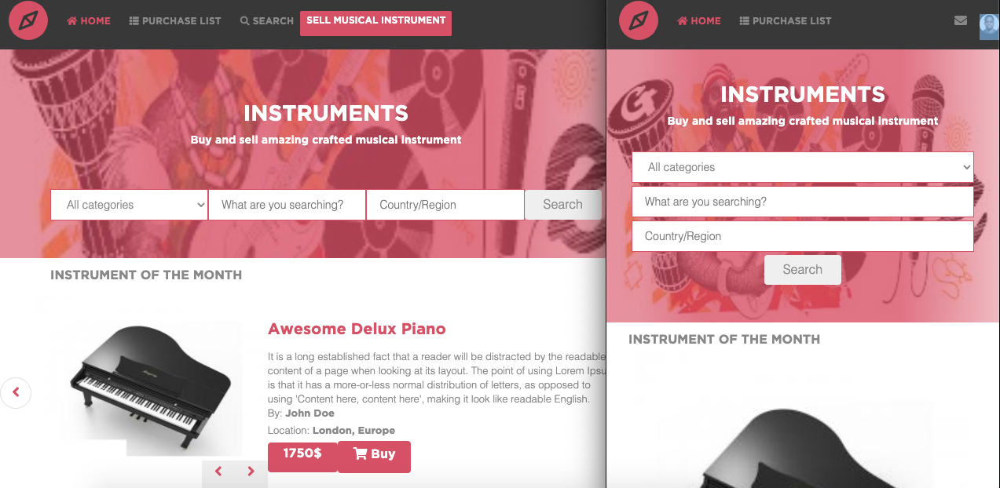
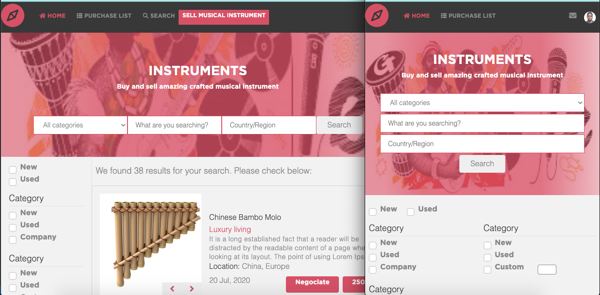

# Online musiscal shop (index and search page) - Built time 72 hours

> This is a capstone/exam project for the [Microverse](https://www.microverse.org) module HTML/CSS. It is a musical instrument website for different instrument including local, website using HTML, CSS3/SCSS, Bootstrap, and Font awesome.

## Watch a video presentation of the project [here](https://www.loom.com/share/89eaad41f2714de4b45b8ca87b4cffb7)

## Screenshot of the home page

## Screenshot of the search page

[find design specification by Mohammed Awad here](https://www.behance.net/gallery/24796463/ZATTIX)

The project is built using HTML and CSS/SCSS with an extensive use of the grid and flex propreties. I used all SCSS core functionality: variables, mixins and color functions.

## Built With

- HTML
- CSS3/SCSS
- Bootstrap
- Font awesome icons
- Webhint/Stylelint linters
- NPM scripts for testing and running the SCSS changes

## Live Demo

[Live Demo](https://dansam5k.github.io/Capstone-project-Html-css/)

(You can navigate between pages using the navigation links and the search form.)

## To get a local copy up and running follow these simple example steps.

### Setup

Clone the project locally using  _git clone git@github.com:DanSam5K/Capstone-project-Html-css.git_

### Linters

1. run `npm install`.
2. run `npm run test` to check the HTML and CSS files.
2. run `npm run watch` to start watching for SCSS changes.

### Deployment

Install and run a live server plugin on you IDE/Text editor and run it from the root directory.

### Future improvements

Add a backend to the page

## Authors

👤 **Daniel Samuel**
- Github: [DanSam5k](https://github.com/DanSam5k)
- Twitter: [@_dan_sam](https://twitter.com/_dan_sam)
- Linkedin: [dansamuel](https://www.linkedin.com/in/dansamuel/)

## Show your support

Give a ⭐️ if you like this project!

## 📝 License

This project is [MIT](https://docs.github.com/en/github/creating-cloning-and-archiving-repositories/licensing-a-repository) licensed.